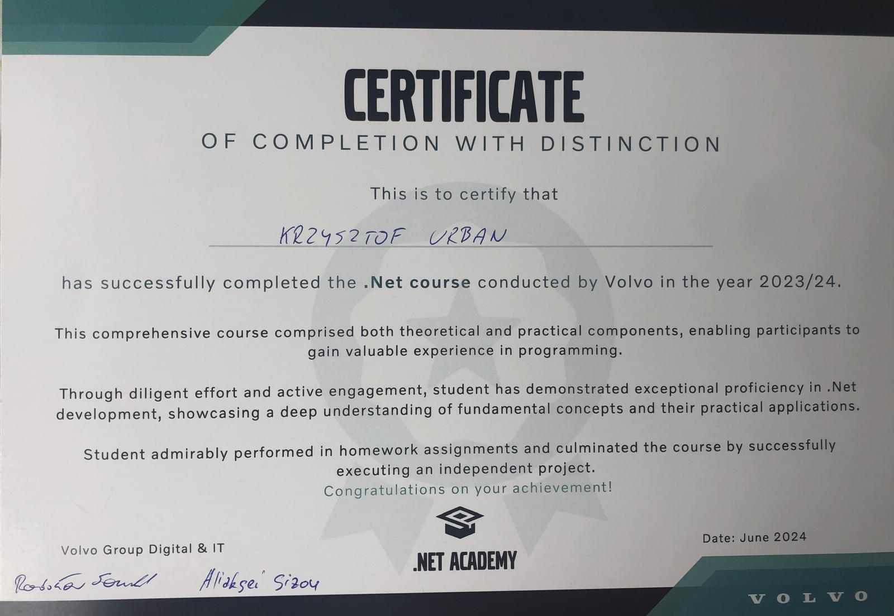
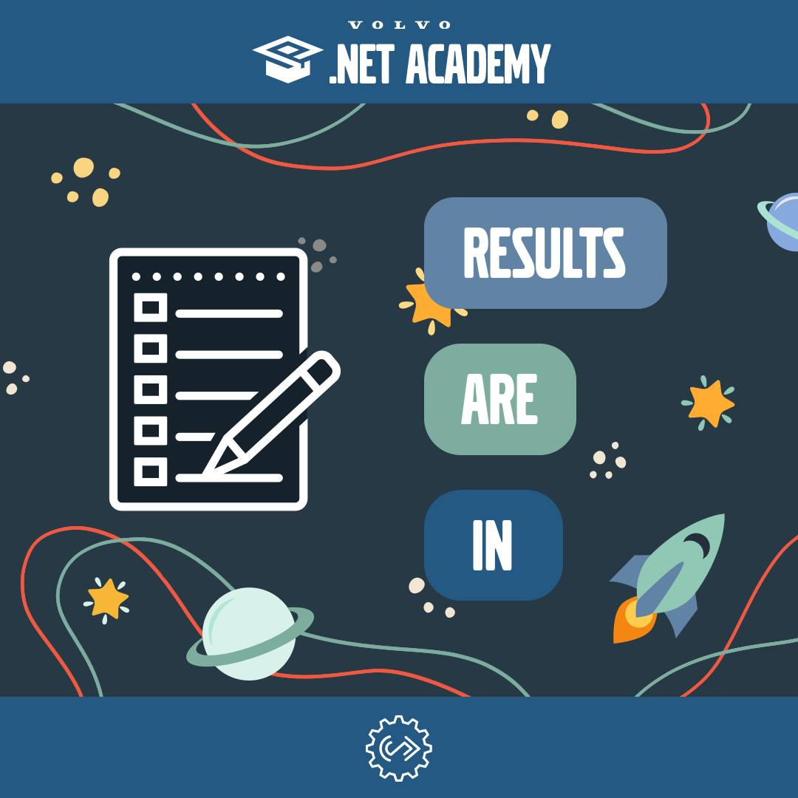
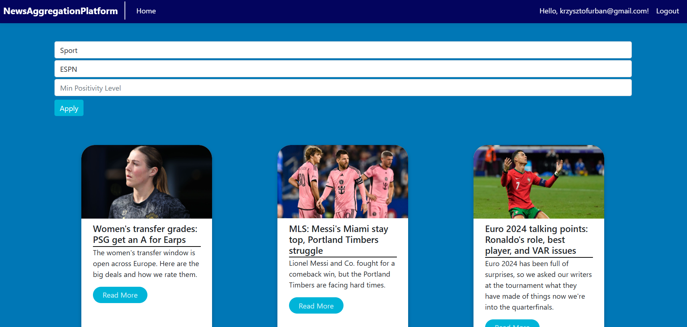
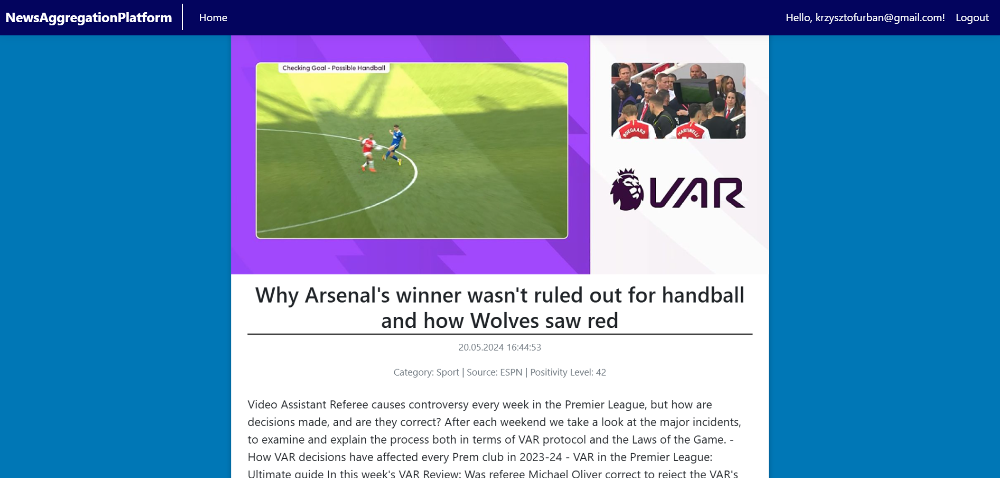
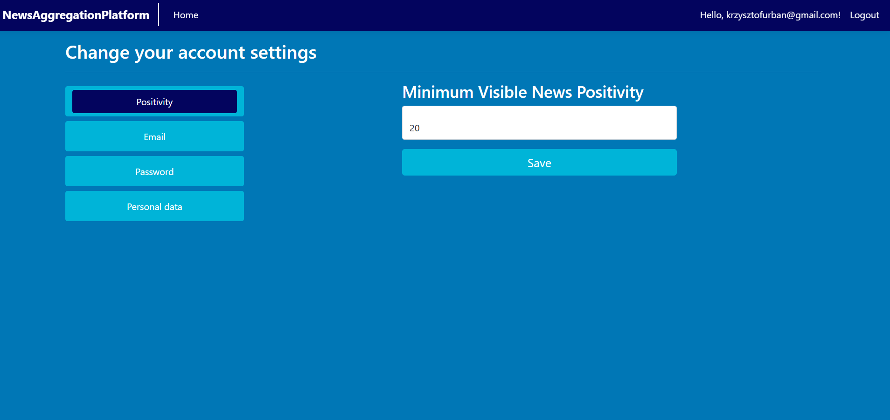
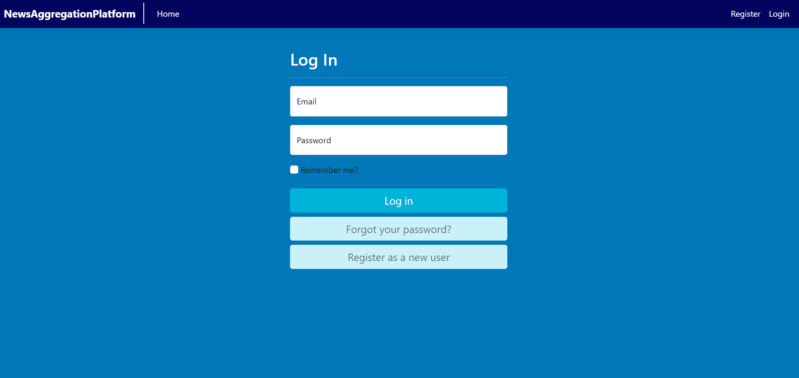
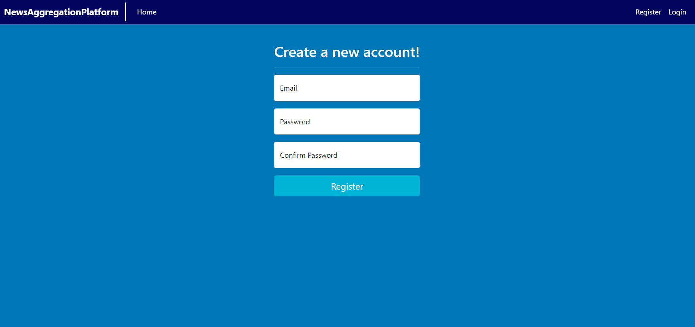
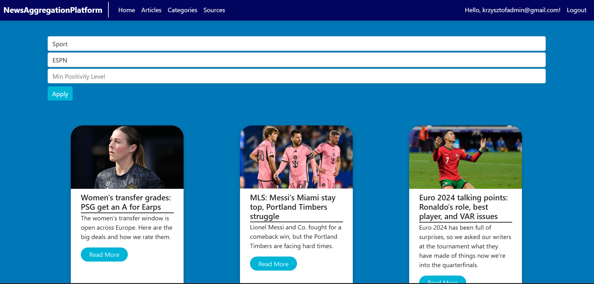
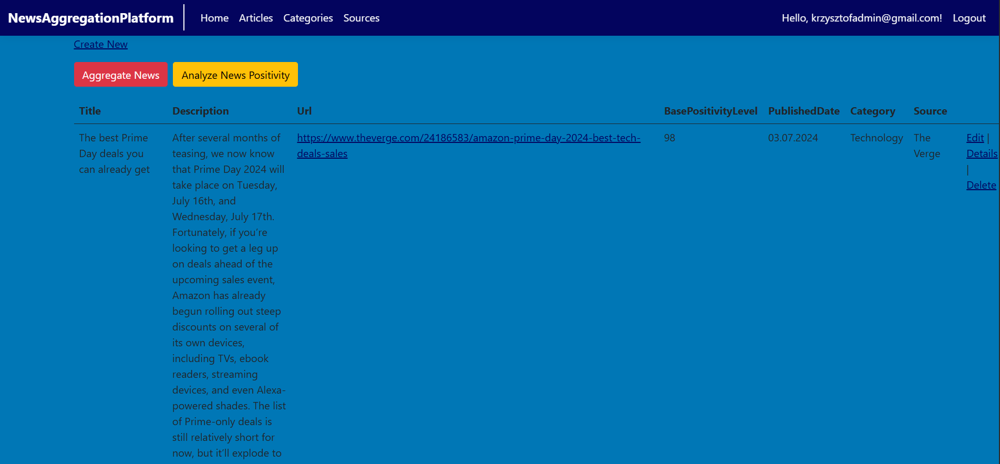
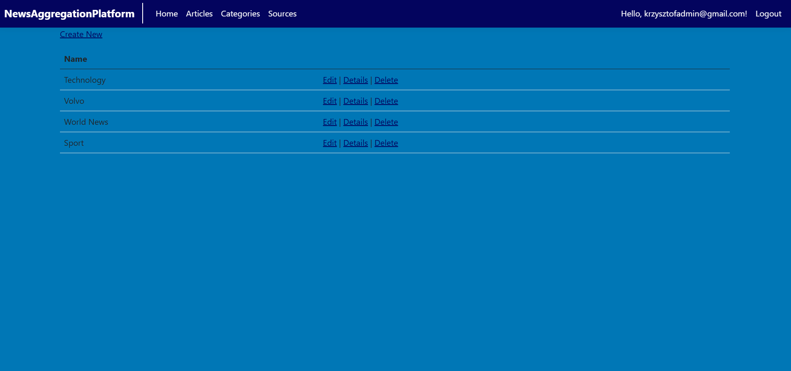

# News Aggregation Platform - Volvo Academy Final Project

<div align="center">


**A comprehensive News Aggregation Platform developed as the final project for Volvo .NET Academy**

_Demonstrating advanced ASP.NET Core development skills with sentiment analysis, user interaction, and admin management capabilities_

[](https://dotnet.microsoft.com/)
[](https://docs.microsoft.com/en-us/dotnet/csharp/)
[](https://dotnet.microsoft.com/apps/aspnet)

[About the Academy](#about-volvo-net-academy) • [Features](#features) • [Screenshots](#screenshots) • [Tech Stack](#tech-stack) • [Getting Started](#getting-started) • [Architecture](#architecture)

</div>

---

## About Volvo .NET Academy

<div style="display: flex; justify-content: space-around;">



</div>

### Program Overview

This project was developed as the **final project** for the **Volvo .NET Academy** internship/course program, which ran from **November 2023 to June 2024**. The academy provided comprehensive training in modern .NET development practices and enterprise-level software engineering.

### Academy Curriculum Highlights

[Check the full program!](https://docs.google.com/document/d/1cfjHCZxmdv9Jn93kD5CrDV7pa0FErIDvPNM5bJQ1Ccw/edit?pli=1&fbclid=IwZXh0bgNhZW0CMTAAAR1dcEJKAcIRVnTu72ylGRF8UvL951n0t6p0EcDUrV4gMtih319n6CMt9FQ_aem_AQZTzOvMaUdtTP1ev6ercOt3imvODNarxFGAoxpohbtiTfsxRGNM0Kz98XqI0Rt30UiE81WIQV4BW6Hi_IBPbEl6&tab=t.0)

The 8-month intensive program covered essential topics for professional .NET development:

#### Core Programming Fundamentals

- **C# Fundamentals** - Advanced language features and best practices
- **Object-Oriented Programming (OOP)** - Design principles and patterns
- **LINQ** - Language Integrated Query for data manipulation
- **Multithreading & Asynchronous Programming** - Building responsive applications

#### Web Development

- **ASP.NET Core Essentials** - Modern web application development
- **MVC Architecture** - Model-View-Controller pattern implementation
- **Web API Development** - RESTful API design and implementation
- **Client-Server Architecture** - Understanding distributed systems

#### Software Architecture & Design

- **Multilayer Architecture** - Separation of concerns and modular design
- **SOLID Principles** - Writing maintainable and scalable code
- **Design Patterns** - Common solutions to recurring problems
- **Clean Architecture** - Implementing testable and maintainable systems

#### Data & Database Management

- **SQL Server & Entity Framework Core** - Database design and ORM
- **Data Validation** - Ensuring data integrity and security
- **Database Optimization** - Performance tuning and best practices

#### Enterprise Development Practices

- **HTTP Protocol** - Understanding web communication
- **Security** - Authentication, authorization, and data protection
- **Application Configuration** - Managing settings and environments
- **Filters & Middleware** - Request/response pipeline customization
- **Diagnostics & Logging** - Monitoring and troubleshooting applications
- **Unit Testing** - Writing testable code with xUnit
- **Application Optimization** - Performance improvement techniques

### About Volvo Group

The Volvo Group is one of the world's leading manufacturers of trucks, buses, construction equipment, and marine and industrial engines. With approximately 5,000 IT professionals across more than 30 countries, the Digital & IT division is at the forefront of technological innovation in sustainable transport solutions.

The academy program reflects Volvo's commitment to:

- **Talent Development** - Investing in the next generation of software engineers
- **Knowledge Transfer** - Mentorship from experienced industry professionals
- **Innovation** - Encouraging creative problem-solving and modern development practices
- **Sustainability** - Building solutions for a more sustainable future

### Project Objectives

This News Aggregation Platform was designed to demonstrate proficiency in:

**Full-Stack Development** - Building complete web applications with ASP.NET Core  
**Clean Architecture** - Implementing separation of concerns across multiple projects  
**Database Design** - Creating normalized, efficient database schemas  
**API Development** - Designing and implementing RESTful web services  
**Authentication & Authorization** - Implementing secure user management with ASP.NET Identity  
**Machine Learning Integration** - Incorporating ML.NET for sentiment analysis  
**Testing** - Writing comprehensive unit and integration tests  
**Project Management** - Planning and executing a complex software project from conception to deployment

---

## Table of Contents

- [About Volvo .NET Academy](#about-volvo-net-academy)
- [Overview](#overview)
- [Features](#features)
- [Screenshots](#screenshots)
- [Tech Stack](#tech-stack)
- [Database Schema](#database-schema)
- [Sentiment Analysis](#sentiment-analysis)
- [Getting Started](#getting-started)
- [Architecture](#architecture)
- [Project Structure](#project-structure)
- [Acknowledgments](#acknowledgments)

---

## Overview

**News Aggregation Platform** is a modern, full-featured news aggregation platform built with ASP.NET Core that aggregates news articles from multiple English-language sources. The platform features intelligent sentiment analysis, personalized content recommendations, and comprehensive user interaction capabilities.

### Key Highlights

- **Automated News Aggregation** – Fetches and curates news from diverse sources
- **AI-Powered Sentiment Analysis** – Built-in positivity scoring using local Machine Learning model
- **User-Generated Content** – Community members can submit their own news articles
- **Interactive Features** – Upvote/downvote, comment, and rate articles
- **Admin Dashboard** – Comprehensive content management system

---

## Features

### For Users

#### News Consumption

- Browse curated news articles from multiple trusted sources
- Filter articles by categories, sources and "news positivity level"
- View article thumbnails and concise summaries
- Read full articles with sentiment indicators
- Access personalized content recommendations

#### Personalization

- Customize news preferences by category
- Filter content based on sentiment scores
- Track reading history and favorite articles
- Receive tailored content suggestions

#### Community Interaction

- Vote on articles (upvote/downvote)
- Comment on articles and engage in discussions _(TODO)_
- Rate articles based on perceived positivity

#### User Profile

- Manage account settings and preferences
- Track your submitted articles
- View data consents

### For Administrators

#### Content Management

- **Articles Management** - Review, edit, approve, or reject articles
- **Data Fetching** - Trigger automatic news data fetching from chosen news sources
- **Sentiment Analysis** - Trigger news sentiment analysis
- **Sources Management** - Add, edit, or remove news sources
- **Categories Management** - Organize content taxonomy
- **User Moderation** - Manage user accounts and permissions

---

## Screenshots

### User Interface

**// Not the best UI - project was more focused on backend skills (.NET ACADEMY) :D - to be rewritten with React in the future.**

#### Home Page


_The main landing page featuring trending articles and personalized recommendations_

#### News Feed


_Browse and filter news articles with sentiment indicators_

#### User Profile


_Manage your account, preferences, and submitted content_

### Authentication

#### Login


_Secure user authentication with email and password_

#### Register


_Create a new account to access full platform features_

### Admin Panel

#### Admin Dashboard


_Comprehensive overview of platform metrics and activity_

#### Article Management


_Review, approve, and manage all articles on the platform_

#### Source Management


_Configure and monitor news sources_

#### Category Management


_Organize and maintain article categories_

---

## Tech Stack

### Backend

- **Framework**: ASP.NET Core 6.0+
- **Language**: C# 10.0
- **Database**: SQL Server / Entity Framework Core
- **Authentication**: ASP.NET Core Identity
- **API**: RESTful Web API

### Frontend

- **Razor Pages** / **MVC Views**
- **HTML5** & **CSS3**
- **JavaScript** (ES6+)
- **Bootstrap** for responsive design

### Additional Technologies

- **Sentiment Analysis**: ML.NET (Machine Learning library)
- **News APIs**: Integration with external news sources

  (...)

---

## Database Schema


### Key Entities

- **Users** – User accounts with authentication and profile data
- **Articles** – News articles with content, metadata, and sentiment scores
- **Sources** – News source information and configuration
- **Categories** – Article categorization and taxonomy
- **Comments** – User comments and discussion threads
- **Votes** – Article upvotes and downvotes
- **Ratings** – User-submitted positivity ratings

---

## Sentiment Analysis

### Overview

News Aggregation Platform includes a built-in sentiment analysis feature that automatically determines whether news articles convey **positive** or **negative** sentiment. This helps users quickly see the emotional tone of news content.

### How It Works

#### Local Machine Learning

Unlike many applications that rely on external AI services, our sentiment analysis runs **entirely locally** using Microsoft's ML.NET framework. This means:

- **No API costs** - Completely free to use
- **Works offline** - No internet connection required
- **Fast processing** - No network latency
- **Data privacy** - Your content never leaves the server

## Getting Started

### Prerequisites

- [.NET SDK 6.0+](https://dotnet.microsoft.com/download)
- [SQL Server](https://www.microsoft.com/sql-server) or [SQL Server Express](https://www.microsoft.com/sql-server/sql-server-downloads)
- [Visual Studio 2022](https://visualstudio.microsoft.com/) or [Visual Studio Code](https://code.visualstudio.com/)
- [Git](https://git-scm.com/)

### Installation

1. **Clone the repository**

```bash
   git clone https://github.com/urbanKR/volvo-academy-final-project.git
   cd volvo-academy-final-project
```

2. **Navigate to the project directory**

```bash
   cd NewsAggregationPlatform
```

3. **Restore dependencies**

```bash
   dotnet restore
```

4. **Configure the database connection**

   Update the connection string in `appsettings.json`:

```json
{
  "ConnectionStrings": {
    "DefaultConnection": "Server=(localdb)\\mssqllocaldb;Database=NewsAggregationDb;Trusted_Connection=True;MultipleActiveResultSets=true"
  }
}
```

5. **Apply database migrations**

```bash
   dotnet ef database update
```

6. **Run the application**

```bash
   dotnet run
```

7. **Access the application**

   Open your browser and navigate to:

   - **User Interface**: `https://localhost:5001`
   - **API Documentation**: `https://localhost:5001/swagger` (if enabled)

### Seed Data (Optional)

To populate the database with sample data for testing:

```bash
dotnet run --seed
```

---

## Architecture

This solution follows **Clean Architecture** principles with clear separation of concerns:NewsAggregationPlatform (Solution)
│
├── NewsAggregationPlatform (Main MVC Application)
│ ├── Presentation Layer - User-facing web interface
│ ├── Controllers - MVC controllers for web pages
│ └── Views - Razor views for UI
│
├── NewsAggregationPlatform.WebApi (REST API)
│ ├── API Layer - RESTful endpoints
│ ├── Controllers - API controllers
│ └── Service Integration
│
└── NewsAggregationPlatform.Tests (Test Suite)
└── Unit and Integration Tests

## Project Structure

### NewsAggregationPlatform (Main MVC Application)

```
NewsAggregationPlatform/
├── Areas/                      # Admin area
│   └── Admin/
│       ├── Controllers/        # Admin controllers
│       └── Views/              # Admin views
├── Controllers/                # Public-facing controllers
│   ├── HomeController.cs
│   ├── ArticlesController.cs
│   ├── AccountController.cs
│   └── ProfileController.cs
├── Models/                     # Domain models
│   ├── Article.cs
│   ├── User.cs
│   ├── Comment.cs
│   └── ...
├── Data/                       # Data access layer
│   ├── ApplicationDbContext.cs
│   └── Migrations/
├── Services/                   # Business logic
│   ├── Abstraction/           # Service interfaces
│   └── Implementation/        # Service implementations
├── Views/                      # Razor views
│   ├── Home/
│   ├── Articles/
│   ├── Shared/
│   └── ...
├── wwwroot/                    # Static files
│   ├── css/
│   ├── js/
│   ├── lib/
│   └── images/
├── Interfaces/                 # Contracts
├── Mappers/                    # DTO mappings
├── appsettings.json           # Configuration
├── Program.cs                 # Application entry point
└── ScaffoldingReadMe.txt      # Scaffolding guide
```

### NewsAggregationPlatform.WebApi (REST API)

```
NewsAggregationPlatform.WebApi/
├── Controllers/                # API controllers
│   ├── ArticlesController.cs
│   ├── CategoriesController.cs
│   ├── SourcesController.cs
│   └── ...
├── Service/                    # API-specific services
├── Properties/
│   └── launchSettings.json    # Launch profiles
├── appsettings.json           # API configuration
└── Program.cs                 # API entry point
```

### NewsAggregationPlatform.Tests (Test Project)

```
NewsAggregationPlatform.Tests/
├── UnitTests/
│   ├── Services/
│   ├── Controllers/
│   └── Models/
├── IntegrationTests/
│   ├── API/
│   └── Database/
├── Fixtures/                   # Test fixtures
└── ArticleServiceTests.cs
```

## Acknowledgments

- Thanks to Volvo Academy for the opportunity and guidance

---
